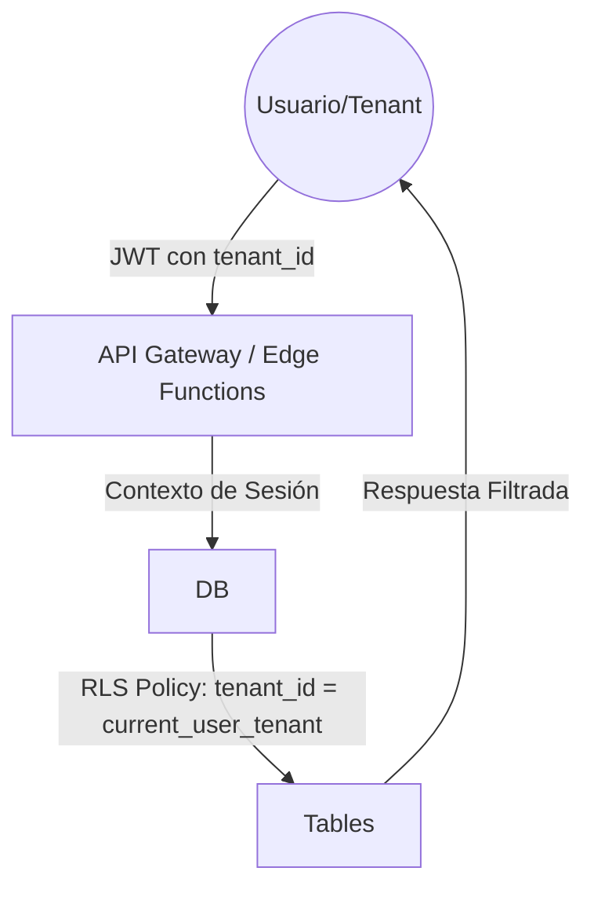

# **MVP: Fase de Lanzamiento Inicial (Scope) con Gestión Integral (GI)**

El alcance mínimo para salir al mercado

## **1\. Alcance de la Fase 1 (MVP)**

El objetivo es tener el sitio web funcional con la estructura básica y UN servicio de IA activo para validación.

* **Proof of Value (PoV):** El MVP debe demostrar valor tangible al usuario en la primera interacción (ej. resolver una duda técnica real o procesar un dato) para validar la hipótesis de negocio.
* 
* **Hipótesis de Valor Medible:**  
  - Hipótesis principal: “Los usuarios perciben valor si el agente resuelve una consulta real en menos de 3 interacciones”.
  - Métrica de validación temprana: % de sesiones con feedback positivo (👍).
  - Umbral de éxito inicial: ≥ 60%.

* **Criterio de Invalidación del MVP:**  
  - Si tras X sesiones no se alcanza el umbral de éxito, el servicio se considera no validado y se itera o descarta.

* **Validación de Feasibilidad de Datos:** El agente debe auditar que los archivos de contexto corporativo son suficientes para alimentar la IA antes de iniciar la codificación del chatbot.  
* **Límite Cognitivo del Agente (Scope Guardrail):**  
  - El agente solo responde sobre información presente en el contexto aprobado.
  - Ante consultas fuera de alcance, debe derivar al formulario de contacto.

* **Alineación con el SGIA (Sistema de Gestión de IA):** Establecer los cimientos de gobernanza y ética basados en la norma ISO 42001 desde el despliegue del primer micro-servicio.  
* **Enfoque de Organización Agéntica:** El MVP no solo valida el producto para el cliente, sino que prueba la capacidad de la agencia para operar con agentes autónomos en el ciclo de soporte inicial.  
* **Fundamentos de Datos (Multi-Tenancy):** Implementación del **Modelo Pool (Shared Schema)** mediante **Supabase/PostgreSQL**. El aislamiento de datos se garantiza mediante políticas de **Row-Level Security (RLS)** en el motor de base de datos.

### **Flujo de Datos y Aislamiento**

Fragmento de código

* **Regla de Oro de Seguridad:** Cada consulta debe ser filtrada automáticamente por la base de datos basándose en el identificador único del cliente.  

## **2\. Funcionalidades Incluidas (In-Scope)**

* **Clasificación de Prioridad:**
  - P0 (Crítico para validación): Landing, Demo de IA, Feedback.
  - P1 (Soporte a escalado): CRM básico, Memoria vectorial.
  - P2 (Arquitectura futura): Marketplace, Pagos, Comisión.

* \[ \] **Landing Page:** Hero section, servicios básicos y pie de página.  
* \[ \] **Catálogo Estático:** Lista de 3 productos/servicios principales.  
* \[ \] **Demo de IA Única:** Un agente de chat simple entrenado con la información de nuestra empresa (Playground).  
* \[ \] **Formulario de Contacto:** Captura de leads básica conectada a base de datos.  
* \[ \] **Diseño:** Implementación de shadcn/ui con tema oscuro/claro.  
* **Identidad Visual vía Stitch MCP:** Generación de lenguaje visual coherente (colores, iconos y logos) integrado directamente en los componentes de React/Next.js. 
* **Capa de Feedback de Usuario:** Un sistema de "pulgar arriba/abajo" en la demo de IA para recolectar datos de precisión desde el primer día.  
* **Feedback Cualitativo Ligero:**  
  - En caso de 👎, permitir seleccionar un motivo rápido:
    - Respuesta incorrecta
    - Respuesta incompleta
    - No era lo que buscaba
* **Módulo GI de Gestión de Proyectos:** Panel interno para seguimiento de tareas técnicas y sprints integrados con agentes de desarrollo.  
* **Módulo GI Comercial/CRM Básico:** Registro automatizado de leads y centralización de interacciones de preventa capturadas por el agente de IA.  
* **Capa de Percepción y Memoria:** Configuración de una base de datos vectorial (Supabase \+ pgvector) que actúe como memoria de largo plazo para el Playground.  
* **Marketplace & Pagos:** Arquitectura **Stripe Connect** donde GI actúa como plataforma central. Se utilizarán **Destination Charges** para retener comisiones por transacciones de servicios.  

## **3\. Lo que NO se incluirá (Out-of-Scope)**

* Pasarela de pagos (Stripe) en su versión final transaccional (solo arquitectura inicial).  
* Dashboard de usuario complejo.  
* Múltiples idiomas (inicialmente solo Español).  
* **Refactorización Profunda:** No se optimizará el código para millones de usuarios; el enfoque es la validación funcional inmediata.  
* **Personalización Extrema:** No se implementarán perfiles de usuario avanzados ni guardado de historial de chat en esta fase.  
* **Gestión Financiera Completa:** Los módulos de conciliación bancaria y contabilidad tributaria automática se desplazarán a la Fase 2\.
* **Principio de Exclusión Activa:**  
  - Todo lo no listado explícitamente en “In-Scope” se considera fuera del alcance, incluso si es técnicamente sencillo.

## **4\. Plan de Ejecución Agéntica (Instrucciones para Antigravity)**

**Instrucción de Orquestación:** El agente debe seguir un flujo de 3 pasos por cada tarea: 1\. Propuesta de Arquitectura (Markdown), 2\. Crítica de Riesgos, 3\. Implementación.

### **Protocolo Git y Checkpoints (Seguridad de Misión)**

Cada misión del agente debe seguir este script de inicialización:

1. git checkout \-b feat/GI-MISSION-  
2. antigravity checkpoint create \--label "Base estable antes de MISSION-"  
3. **Notificación:** "Lee el README.md y el archivo.cursorrules. No rompas la arquitectura hexagonal."

### Política de Autonomía Progresiva

- Sprint 1: Autonomía limitada (solo scaffolding y lectura).
- Sprint 2: Autonomía media (implementación bajo reglas).
- Sprint 3: Autonomía alta (optimización y tests).

### **Slices de Desarrollo (Primer Sprint: Misión de Despegue):**

1. **Paso 1 (Tarea 01 \- agregado):** Generar la estructura de carpetas gi-core/ según la arquitectura hexagonal definida.  
2. **Paso 2 (Tarea 02 \- agregado):** Crear esquema auth y tablas de tenants en Supabase con RLS activo por tenant\_id.  
3. **Paso 3 (Tarea 03 \- branding):** Implementar Landing Page institucional estática con la identidad visual de **GI (Gestión Integral)** 
4. **Paso 4 (Tarea 04 \- agregado):** Crear componente de catálogo (**Catalog View**) que liste los módulos de referencia (CRM, Control Horario) en modo placeholder.  
* **Paso 5 (Tarea 05 - agregado):** Configurar el endpoint de integración con Stripe Connect **en modo stub/sandbox, sin transacciones activas**. 
6. **Paso 6 (Verificación):** Verificar responsividad en móvil usando el Browser Tool de Antigravity y capturar resultados.

## **5\. Definición de "Terminado" (Done)**

* El sitio es accesible vía URL local/despliegue.  
* El chat de IA responde correctamente sobre los servicios de la empresa.  
* No hay errores de linting o tipos en la consola.  
* **Verificación vía Artefactos:** El agente debe haber generado un Walkthrough (recorrido grabado) y Screenshots que demuestren que los flujos críticos funcionan.
* **Auditoría de Diseño:** El resultado debe pasar el comando /design-qa de Stitch para asegurar accesibilidad WCAG 2.1 y coherencia visual.  
* **Seguridad Básica:** Confirmar que no hay API Keys ni secretos expuestos en el código fuente mediante un escaneo del agente.
* **Gobernanza HITL (Human-in-the-Loop):**  
  * Escritura de código: Autonomía Alta (Auto-generación de tests).  
  * Comandos de Infraestructura: HITL (Requiere aprobación manual del PM).  
  * Merges: HITL (Requiere revisión de Walkthrough).  
* **Tabla de Cumplimiento Técnico (Compliance):**

| Requisito                | Estándar GI    | Verificación en Antigravity                   |
| :----------------------- | :------------- | :-------------------------------------------- |
| **Aislamiento de Datos** | RLS PostgreSQL | Query Test: Fallo si no hay tenant\_id.       |
| **Gobernanza**           | HITL           | antigravity.deny list activo.                 |
| **Auditabilidad**        | Artifacts      | Browser Recording obligatorio por commit.     |
| **Integración Legacy**   | REST API v1    | Endpoint /api/v1/integration con Bearer Auth. |

* **KPIs de Gestión Integral:**  
  * Tasa de precisión de la IA en tareas de información básica.  
  * Tasa de finalización de flujos de contacto sin intervención humana.
  * Generación automática de informe de riesgos técnicos y éticos (ISO 42001).
  
## (agregado) KPI Primario del MVP

- (agregado) El KPI primario del MVP es la **conversión Demo → Contacto**.
- (agregado) Todas las demás métricas (OQ, precisión, feedback) actúan como **indicadores de soporte** para explicar este resultado.
- (agregado) Ninguna optimización secundaria justifica mejoras si no impacta positivamente en el KPI primario.

* **Decisión de Continuidad del MVP:**  
  - Continuar → Se cumplen KPIs mínimos.
  - Pivotar → Valor percibido pero mal encuadrado.
  - Cancelar → No se alcanza PoV tras iteraciones definidas.

## 6\. Criterios de Éxito del MVP

El MVP se considera validado si, dentro de los primeros 60–90 días:

- La conversión visitante → interacción con demo es ≥ 20%.
- La conversión demo → contacto es ≥ 3%.
- El tiempo promedio para percibir valor (ROI percibido) es < 2 minutos.
- Al menos un caso de uso genera intención comercial explícita.
- El OQ (Outcome Quality) promedio es ≥ 4.5/5.

## 7\. Criterios de Fracaso / Revisión del MVP

El MVP debe ser revisado estratégicamente si:

- La conversión demo → contacto es < 1.5% luego de 90 días.
- El abandono ocurre antes de los primeros 30 segundos de interacción.
- El OQ promedio es < 4.0/5 de forma sostenida.
- Se requieren explicaciones humanas frecuentes para comprender las demos.

## 8\. Definition of Done del MVP

El MVP se considera completo únicamente si:

- Todas las funcionalidades definidas están operativas en entorno productivo.
- Las demos pueden ejecutarse sin intervención humana.
- Las métricas clave están instrumentadas y visibles.
- La documentación mínima está disponible (uso, límites, propósito).
- El agente de IA puede explicar correctamente el alcance del MVP.

### 8.1. Autoridad de Cierre del MVP

- El cierre formal del MVP requiere validación humana explícita.
- La autoridad final de aceptación es el **Product Owner / PM**.
- Ningún agente puede declarar el MVP como validado sin esta confirmación.

## 9\. Riesgos Operativos y Mitigaciones

- Riesgo: Baja adopción del Playground.
  - Mitigación: Simplificación del flujo inicial y refuerzo del valor en los primeros 30 segundos.

- Riesgo: Interpretación incorrecta de las demos.
  - Mitigación: Mensajes de contexto y disclaimers claros.

- Riesgo: Sobrecarga operativa por interés temprano.
  - Mitigación: Automatización del contacto inicial y priorización por intención.

## 10\. Regla de No-Expansión del Alcance (Freeze del MVP)

- Durante la ejecución del MVP no se agregarán nuevas funcionalidades.
- Las mejoras se limitarán a ajustes de UX, performance o claridad del valor.
- Toda nueva idea será documentada para fases posteriores, sin alterar el alcance actual.

## 11\. (agregado) Aclaración de Alcance Funcional del MVP

- (agregado) Los módulos de Marketplace, Pagos, CRM y Comisión se incluyen únicamente a nivel **arquitectural y estructural**.
- (agregado) Durante el MVP estos módulos permanecen **desactivados funcionalmente**.
- (agregado) El único servicio activo para validación de valor es la **Demo de IA (Playground)**.

## 12\. (agregado) Jerarquía de Criterios de Finalización

- (agregado) La sección **“Definición de Terminado (Done)”** aplica a nivel **tarea / sprint / misión agéntica**.
- (agregado) La sección **“Definition of Done del MVP”** aplica exclusivamente al **cierre completo de la Fase MVP**.
- (agregado) En caso de conflicto, prevalece la **Definition of Done del MVP**.
